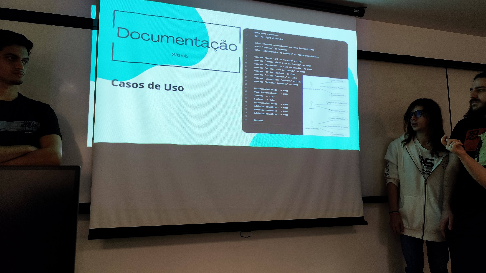
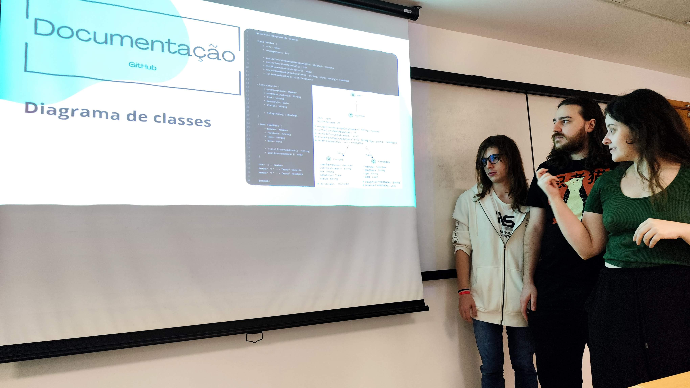

# 24.2

## Disciplinas

### Projeto Back-End 8001 (Manhã)

#### [PBE_24.2_8001_I_BrainBox](https://github.com/Projetos-de-Extensao/PBE_24.2_8001_I_BrainBox)

- [Documentação](https://projetos-de-extensao.github.io/PBE_24.2_8001_I_BrainBox/)
- [Apresentação]()
- [Slide]()

| Imagem 1 | Imagem 2 |
|----------|----------|
|  |  |  

#### [PBE_24.2_8001_II_Vascode](https://github.com/Projetos-de-Extensao/PBE_24.2_8001_II_Vascode)

- [Documentação](https://projetos-de-extensao.github.io/PBE_24.2_8001_I_BrainBox/)
- [Apresentação]()
- [Slide]()

| Imagem 1 | Imagem 2 |
|----------|----------|
|  |  |  

#### [PBE_24.2_8001_III_EVE-Plus](https://github.com/Projetos-de-Extensao/PBE_24.2_8001_III_EVE-Plus)

- [Documentação](https://projetos-de-extensao.github.io/PBE_24.2_8001_I_BrainBox/)
- [Apresentação]()
- [Slide]()

| Imagem 1 | Imagem 2 |
|----------|----------|
|  |  |  

#### [PBE_24.2_8001_IV_HighlightHub](https://github.com/Projetos-de-Extensao/PBE_24.2_8001_IV_HighlightHub)

- [Documentação](https://projetos-de-extensao.github.io/PBE_24.2_8001_I_BrainBox/)
- [Apresentação]()
- [Slide]()

| Imagem 1 | Imagem 2 |
|----------|----------|
|  |  |  

#### [PBE_24.2_8001_V_CODE4LIFE](https://github.com/Projetos-de-Extensao/PBE_24.2_8001_V_CODE4LIFE)

- [Documentação](https://projetos-de-extensao.github.io/PBE_24.2_8001_I_BrainBox/)
- [Apresentação]() 
- [Slide]()

| Imagem 1 | Imagem 2 |
|----------|----------|
|  |  |  

### Projeto Back-End 8002 (Tarde)

#### [PBE_24.2_8002_I_MMAA](https://github.com/Projetos-de-Extensao/PBE_24.2_8002_I_MMAA)

- [Documentação](https://projetos-de-extensao.github.io/PBE_24.2_8001_I_BrainBox/)
- [Apresentação]()
- [Slide]()
 
| Imagem 1 | Imagem 2 |
|----------|----------|
|  |  |  

##### Vídeo do Projeto

<video width="600" controls>
  <source src="caminho/para/o/video.mp4" type="video/mp4">
  Seu navegador não suporta a tag de vídeo.
</video>

#### [PBE_24.2_8002_II_Pandora](https://github.com/Projetos-de-Extensao/PBE_24.2_8002_II_Pandora)

- [Documentação](https://projetos-de-extensao.github.io/PBE_24.2_8001_I_BrainBox/)
- [Apresentação]()
- [Slide]()
  
| Imagem 1 | Imagem 2 |
|----------|----------|
|  |  |  