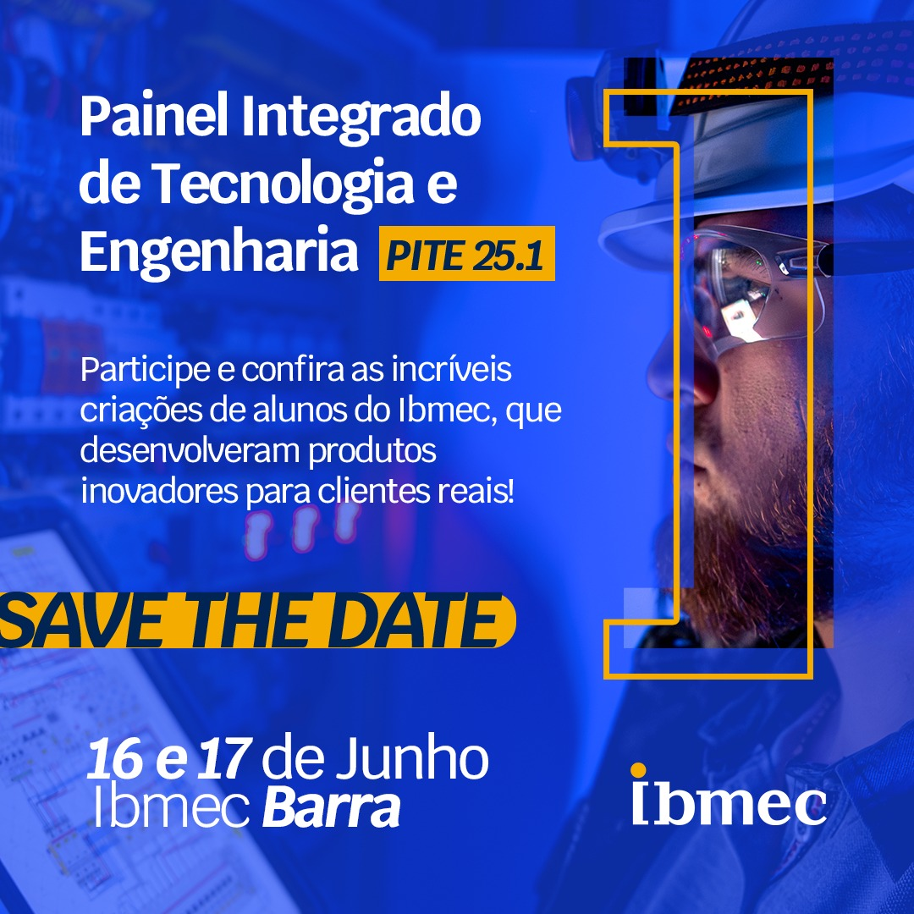

# PITE 25.1 – Painel Integrado de Tecnologia e Engenharia.

Nos dias 16 e 17 de junho, o campus Ibmec Barra será o ponto de encontro entre conhecimento, inovação e prática profissional com a realização do PITE 25.1 – Painel Integrado de Tecnologia e Engenharia.

O evento reúne apresentações dos Projetos Aplicados desenvolvidos por alunos dos cursos de Engenharia e Tecnologia, que criaram soluções reais para clientes reais – empresas, startups e instituições públicas e privadas. Cada equipe irá apresentar seus produtos a partir de desafios práticos propostos ao longo do semestre.

Além disso, o PITE também marca o momento da defesa dos Trabalhos de Conclusão de Curso (TCC), com bancas avaliadoras formadas por professores e convidados do mercado.

Será uma verdadeiro encontro de talentos, com ideias transformadas em produtos, conexões com o mercado e a demonstração da força da aprendizagem aplicada no Ibmec.

O evento é exclusivo para alunos, professores, orientadores e profissionais convidados.
📍 Data: 16 e 17 de junho
🕐 Horários: Turno da tarde e noite
📌 Local: Ibmec Barra